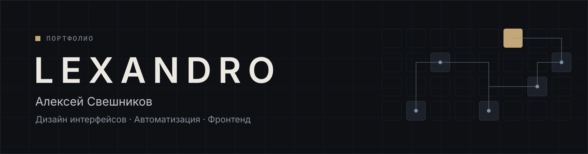

Проектирую интерфейсы и автоматизирую процессы: от дизайн-системы в Figma до работающего кода на Next.js и сценариев в n8n.

[Сайт-портфолио](https://lexandro-design.github.io/portfolio/) · [Профиль GitHub](https://github.com/lexandro-design) · [Контакты](#контакты)

## Содержание

- [Обо мне](#обо-мне)
- [Навыки](#навыки)
- [Кейсы](#кейсы)
- [Контакты](#контакты)

## Обо мне

Алексей Свешников, Санкт-Петербург. Дизайнер интерфейсов и разработчик автоматизаций.

Работаю в холдинге ТИТАН-2: дизайн интерфейсов и автоматизация внутренних процессов. Отдельно беру проекты на фрилансе.

## Навыки

<table>
  <tr>
    <th width="33%" align="left">Дизайн интерфейсов</th>
    <th width="33%" align="left">Автоматизация и AI</th>
    <th width="33%" align="left">Фронтенд</th>
  </tr>
  <tr valign="top">
    <td>
      Figma 
      Дизайн-системы 
      Библиотеки компонентов 
      Адаптив на нескольких брейкпоинтах
    </td>
    <td>
      n8n 
      Supabase / PostgreSQL 
      Telegram Bot API 
      RAG, эмбеддинги, Ollama 
      AI-агенты, MCP
    </td>
    <td>
      React 
      TypeScript 
      Next.js (App Router) 
      CSS Modules
    </td>
  </tr>
</table>

## Кейсы

<table>
  <tr valign="top">
    <td width="50%">
      
       <b><a href="cases/parfumeria/">Parfumeria.by</a></b>
       Интернет-магазин парфюмерии: дизайн-система, 450+ экранов в Figma, перенос на Next.js с headless-каталогом из Битрикса
       Figma · Next.js · TypeScript · CSS Modules · Битрикс
    </td>
    <td width="50%">
      
       <b><a href="cases/mimimibot/">mimimibot</a></b>
       Telegram-бот с AI-генерацией фото
       Telegram Bot API · AI
    </td>
  </tr>
  <tr valign="top">
    <td width="50%">
      
       <b><a href="cases/jarvis/">Jarvis</a></b>
       Личный AI-ассистент
       AI-агент · LLM
    </td>
    <td width="50%">
      
       <b><a href="cases/brain-search/">brain-search</a></b>
       Локальный MCP-сервер семантического поиска по базе знаний для Claude Code
       MCP · RAG · Ollama · Hybrid Search
    </td>
  </tr>
</table>

| № | Проект | Направление | Стек | Результат |
|---|---|---|---|---|
| 01 | [Parfumeria.by](cases/parfumeria/) | Дизайн, фронтенд | Figma, Next.js, TypeScript, CSS Modules, Битрикс | уточняется |
| 02 | [mimimibot](cases/mimimibot/) | Автоматизация, AI | Telegram Bot API | уточняется |
| 03 | [Jarvis](cases/jarvis/) | Автоматизация, AI | уточняется | уточняется |
| 04 | [brain-search](cases/brain-search/) | AI-инструменты | MCP, Ollama, эмбеддинги, гибридный поиск | уточняется |

## Контакты

- Telegram: уточняется
- Email: уточняется
- GitHub: [lexandro-design](https://github.com/lexandro-design)

---

Новый кейс добавляется по шаблону — см. [HOW-TO-ADD-CASE.md](HOW-TO-ADD-CASE.md).
