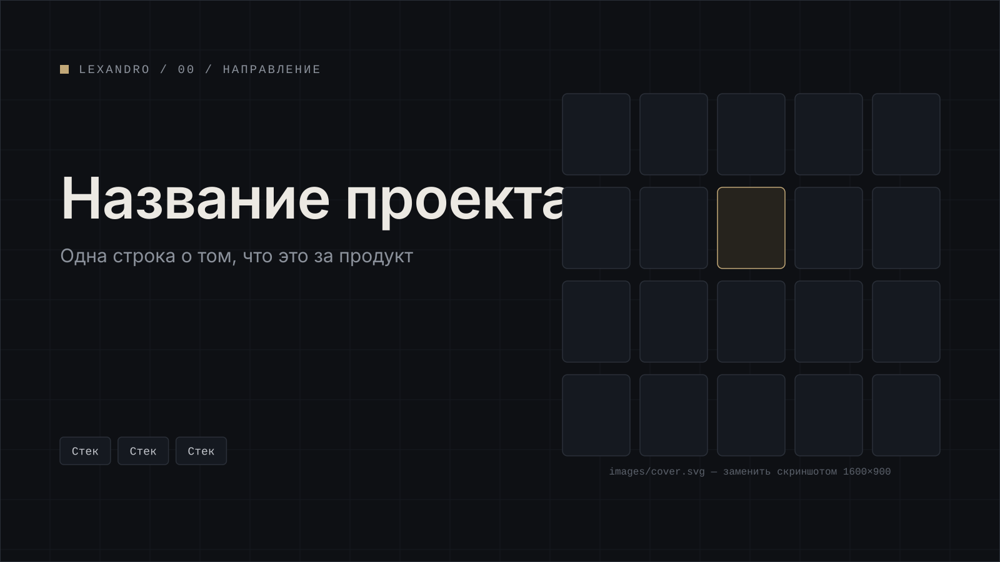

[← Все кейсы](../../README.md)

# Название проекта

Одна-две строки: что это за продукт, для кого и что в нём сделано.

<table>
  <tr><td width="130"><b>Задача</b></td><td>Коротко: какую проблему решал проект</td></tr>
  <tr><td><b>Роль</b></td><td>За что отвечал лично</td></tr>
  <tr><td><b>Стек</b></td><td>Инструмент · Инструмент · Инструмент</td></tr>
  <tr><td><b>Результат</b></td><td>уточняется</td></tr>
  <tr><td><b>Период</b></td><td>уточняется</td></tr>
  <tr><td><b>Ссылки</b></td><td>уточняется</td></tr>
</table>

## Содержание

- [Задача](#задача)
- [Роль](#роль)
- [Что сделано](#что-сделано)
- [Стек](#стек)
- [Результат](#результат)
- [Галерея](#галерея)

## Задача

Исходная ситуация, проблема, ограничения.

## Роль

За что отвечал лично. Если работал в команде — с кем и как делили зоны.

## Что сделано

- Пункт
- Пункт
- Пункт

## Стек

| Область | Инструменты |
|---|---|
| Дизайн | |
| Фронтенд | |
| Данные | |

## Результат

уточняется

<!-- Только проверяемые факты: метрики, сроки, объём, статус запуска. Нет данных — «уточняется». -->

## Галерея

*01 — что на экране*

*02 — что на экране*

*03 — что на экране*

---

[← Все кейсы](../../README.md) · [Следующий кейс: название →](../slug/)
