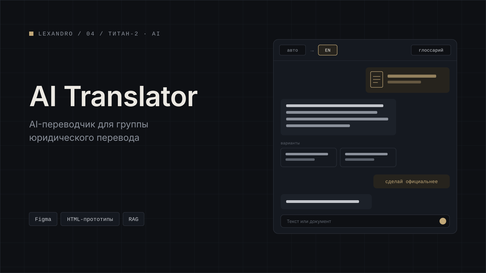

[← Все проекты](../../README.md) · [Работа в ТИТАН-2](../../README.md#работа-в-титан-2)

# ibk AI Translator

AI-переводчик для группы юридического перевода. Через неё проходят переводы документов для зарубежных проектов АЭС.

Интерфейс я сделал в виде чата. Вставляешь текст или загружаешь документ, получаешь перевод и дальше уточняешь его обычными словами, например «сделай официальнее». Язык оригинала определяется сам, выбрать нужно только целевой. Если перевод не устраивает, можно посмотреть альтернативные варианты.

Глоссарии и наборы по языковым парам подключаются автоматически. В настройках две колонки: системы, глоссарии, документы.

Ролей две: администратор работает с переводом, историей и настройками, лингвист только с переводом и историей.

Главное правило, которого я держался: каждый элемент интерфейса должен опираться на конкретное требование ТЗ. Поэтому дашборд и ручной выбор проектов я убрал.

**Стек:** Figma, HTML-прототипы, RAG.

## Скриншоты

Все скриншоты на демо-данных.

*Чат: вставил текст, получил перевод.*

*Загрузка документа.*

*Уточнение перевода в чате.*

*Альтернативные варианты перевода.*

*История переводов.*

*Настройки: системы, глоссарии, документы.*

---

[← Все проекты](../../README.md) · [Дальше: PIX BI →](../pix-bi/)
