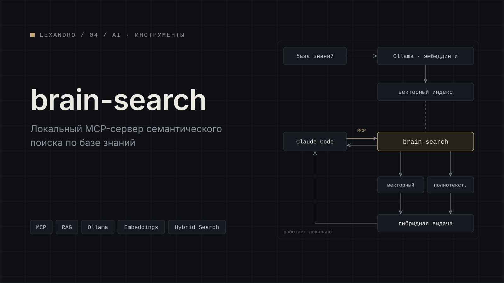

[← Все проекты](../../README.md)

# brain-search

Локальный MCP-сервер, который ищет по моей базе знаний по смыслу, а не только по совпадению слов. Я подключаю его к Claude Code как инструмент.

Эмбеддинги считаются локально через Ollama. Поиск гибридный: векторный по эмбеддингам и полнотекстовый. Найденные фрагменты уходят модели как контекст, то есть это RAG, где индексация и поиск работают на моей машине.

**Стек:** MCP, Ollama, Claude Code.

## Скриншоты

*Claude Code вызывает поиск.*

*Найденные фрагменты с источниками.*

*Подключение сервера к Claude Code.*

---

[← Все проекты](../../README.md) · [Дальше: Jarvis →](../jarvis/)
