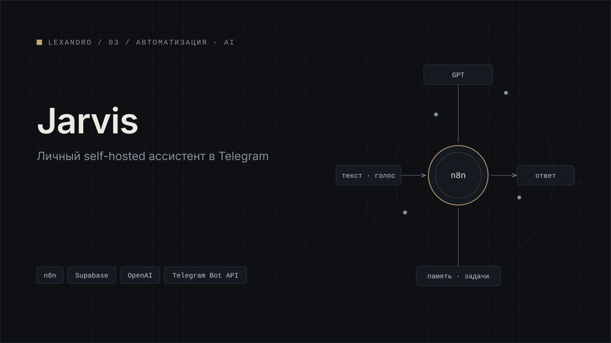

[← Все кейсы](../../README.md)

# Jarvis

Личный AI-ассистент.

<table>
  <tr><td width="130"><b>Задача</b></td><td>уточняется</td></tr>
  <tr><td><b>Роль</b></td><td>уточняется</td></tr>
  <tr><td><b>Стек</b></td><td>уточняется</td></tr>
  <tr><td><b>Результат</b></td><td>уточняется</td></tr>
  <tr><td><b>Период</b></td><td>уточняется</td></tr>
  <tr><td><b>Ссылки</b></td><td>уточняется</td></tr>
</table>

## Содержание

- [Задача](#задача)
- [Роль](#роль)
- [Что сделано](#что-сделано)
- [Стек](#стек)
- [Результат](#результат)
- [Галерея](#галерея)

## Задача

уточняется

<!-- Какие задачи закрывает ассистент: заметки, задачи, календарь, поиск по своим данным, напоминания. -->

## Роль

уточняется

<!-- Например: архитектура агента, интеграции, промпты, память, интерфейс. -->

## Что сделано

- уточняется <!-- канал общения: Telegram, веб, голос -->
- уточняется <!-- инструменты и интеграции агента -->
- уточняется <!-- память и работа с личными данными -->

## Стек

| Область | Инструменты |
|---|---|
| Интерфейс | уточняется |
| Оркестрация | уточняется |
| LLM | уточняется |
| Хранение и поиск | уточняется |

## Результат

уточняется

## Галерея

*01 — пример диалога с ассистентом*

*02 — ассистент выполняет задачу через интеграцию*

*03 — схема архитектуры: входной канал, агент, инструменты, хранилище*

---

[← Все кейсы](../../README.md) · [Следующий кейс: brain-search →](../brain-search/)
