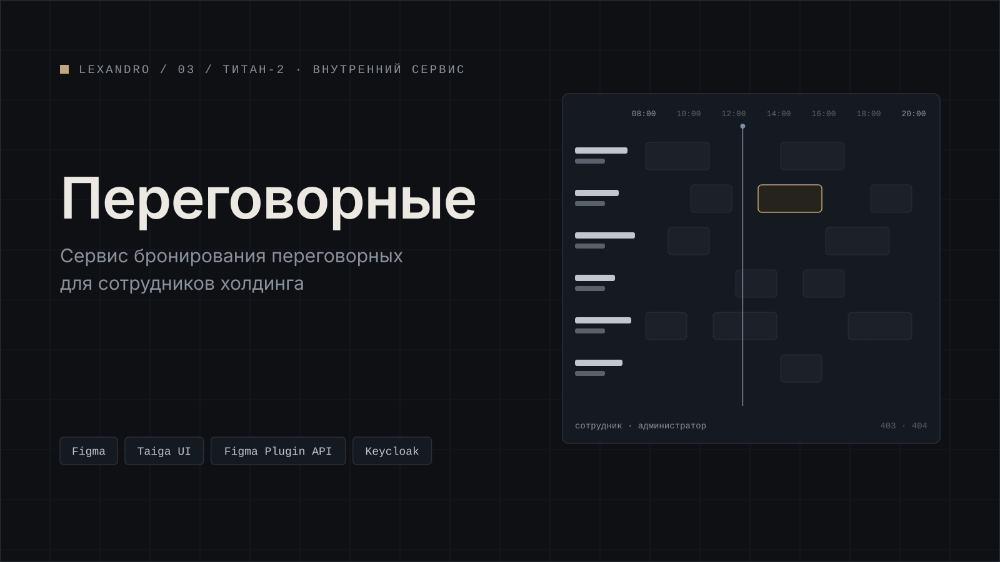

[← Все проекты](../../README.md) · [Работа в ТИТАН-2](../../README.md#работа-в-титан-2)

# Бронирование переговорных

Внутренний сервис, через который сотрудники холдинга бронируют переговорки. Дизайн я сделал по ТЗ и сдал.

## Две роли

Сотрудник выбирает комнату в списке с фильтрами, смотрит расписание в карточке комнаты, создаёт и редактирует бронь. В разделе «Мои бронирования» видно предстоящие, текущие, завершённые и отменённые.

Администратор ведёт комнаты, бронирования и оборудование и смотрит статистику.

## Состояния и правила

Отдельно проработал состояния. У каждого раздела админки есть загрузка, пустой экран, ошибка и все диалоги. Плюс правила из ТЗ: комнаты доступны по локации пользователя, рабочие часы с 08:00 до 20:00, уведомления приходят внутри приложения, профиль берётся из токена Keycloak, для ошибок есть страницы 403 и 404.

## Как собирал

Экраны собирал своими скриптами на Figma Plugin API (JavaScript) из живых компонентов Taiga UI. Канвас разложен по разделам, а фреймы названы по схеме «маршрут · роль · состояние», так что по названию сразу понятно, какой это экран и для кого.

**Стек:** Figma, Taiga UI, Figma Plugin API (JavaScript). Разработка: Angular, Keycloak, PostgreSQL.

## Скриншоты

Все скриншоты на демо-данных.

*Список переговорных с фильтрами.*

*Карточка комнаты с расписанием.*

*Создание и редактирование брони.*

*Мои бронирования.*

*Админка: комнаты.*

*Админка: статистика.*

*Загрузка, пустой экран и ошибка.*

*Диалоги.*

*Страницы 403 и 404.*

*Канвас Figma, разложенный по разделам.*

---

[← Все проекты](../../README.md) · [Дальше: AI Translator →](../ai-translator/)
