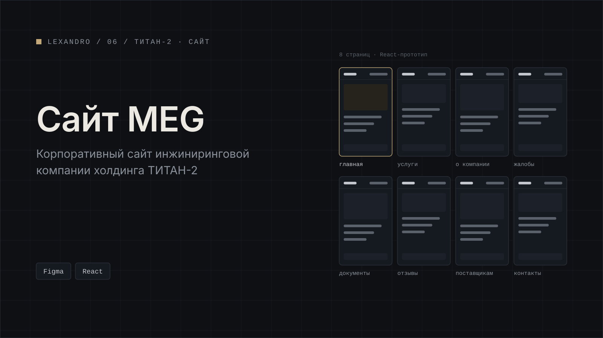

[← Все проекты](../../README.md) · [Работа в ТИТАН-2](../../README.md#работа-в-титан-2)

# Сайт MEG

Корпоративный сайт ООО «Макс Инжиниринг Групп», инжиниринговой компании из холдинга ТИТАН-2.

На сайте восемь страниц: главная, услуги, о компании, жалобы и апелляции, документы, отзывы, поставщикам и контакты.

Кликабельный прототип я собрал на React и сразу наполнил реальным контентом заказчика: ТЗ, презентацией услуг, сертификатами ISO и ГОСТ, отзывами, в том числе от международных заказчиков. Кроме прототипа сделал дизайн в Figma и проверил макеты по содержанию.

**Стек:** Figma, React.

## Скриншоты

Все скриншоты на демо-данных.

*Главная.*

*Услуги.*

*Документы и сертификаты.*

*Отзывы.*

*React-прототип в браузере.*

---

[← Все проекты](../../README.md) · [Дальше: план отпусков →](../vacation-plan/)
