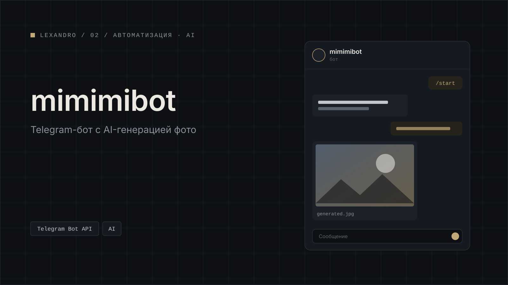

[← Все кейсы](../../README.md)

# MiMiMi AI

Telegram-бот для AI-фотосессий. Собственный продукт.

<table>
  <tr><td width="130"><b>Задача</b></td><td>AI-фотосессии в Telegram: пользователь выбирает готовые кадры и получает их со своим лицом</td></tr>
  <tr><td><b>Роль</b></td><td>Автор: проектирование и разработка</td></tr>
  <tr><td><b>Стек</b></td><td>n8n · Supabase (PostgreSQL + Storage) · Telegram Bot API · YooKassa · API генеративных моделей</td></tr>
  <tr><td><b>Модель</b></td><td>Freemium, оплата через YooKassa</td></tr>
  <tr><td><b>Результат</b></td><td>уточняется</td></tr>
  <tr><td><b>Период</b></td><td>уточняется</td></tr>
  <tr><td><b>Ссылки</b></td><td>уточняется</td></tr>
</table>

## Содержание

- [Задача](#задача)
- [Роль](#роль)
- [Что сделано](#что-сделано)
- [Стек](#стек)
- [Результат](#результат)
- [Галерея](#галерея)

## Задача

Сделать сервис AI-фотосессий внутри Telegram: пользователь выбирает кадры из готовых подборок, а генерации идут с его лицом. Контент бота должен меняться без правки логики, чтобы продукт можно было перенастроить под другую нишу.

## Роль

Автор проекта: проектирование и разработка.

## Что сделано

### Сценарий пользователя

- Карусель готовых кадров по категориям: путешествия, студия и другие.
- Кнопки «Сгенерировать этот кадр» и «Сгенерировать всю фотосессию».

### Цифровой двойник

- Пользователь задаёт имя, загружает 10–20 своих фото (бот проверяет количество) и выбирает параметры внешности.
- Дальше генерации идут с его лицом.

### Генерация

- Несколько моделей на выбор: GPT-Image, Nano Banana Pro / Nano Banana 2.
- Отдельные режимы: генерация по референсам из Pinterest, фильтры, макияж и причёски, «режим бога» с расширенными настройками.

### Архитектура

- Логика целиком в n8n.
- Данные и пресеты в Supabase: таблицы промптов по категориям, Storage для фото-каруселей.
- Всё содержимое — пресеты, тексты, кнопки, картинки — редактируется в Supabase без правки workflow. Бот перенастраивается под любую нишу без разработчика.
- Оплата через YooKassa, модель freemium.

## Стек

| Область | Инструменты |
|---|---|
| Логика | n8n |
| Данные и контент | Supabase (PostgreSQL): промпты по категориям, пресеты, тексты, кнопки |
| Файлы | Supabase Storage: фото-карусели |
| Интерфейс | Telegram Bot API |
| Оплата | YooKassa |
| Генерация | API генеративных моделей: GPT-Image, Nano Banana Pro / Nano Banana 2 |

## Результат

уточняется

<!-- Только подтверждённые данные: пользователи, генерации, конверсия в оплату. -->

## Галерея

*01 — карусель готовых кадров по категориям с кнопками генерации*

*02 — создание цифрового двойника: имя, загрузка фото, параметры внешности*

*03 — выбор модели генерации и режимов*

*04 — готовая фотосессия с лицом пользователя*

*05 — тарифы и оплата через YooKassa*

*06 — workflow бота в n8n*

*07 — таблицы контента и пресетов в Supabase*

---

[← Все кейсы](../../README.md) · [Следующий кейс: Jarvis →](../jarvis/)
