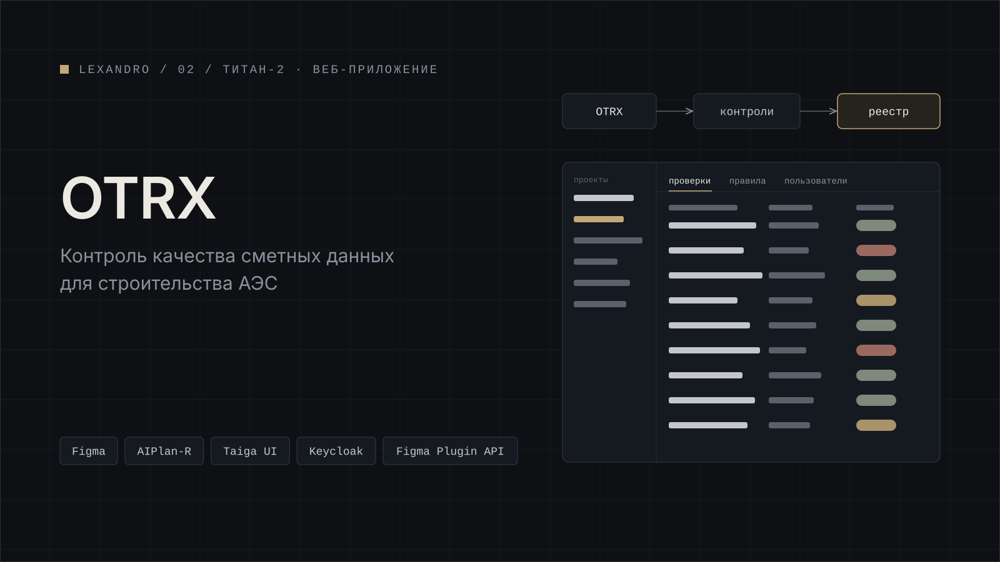

[← Все проекты](../../README.md) · [Работа в ТИТАН-2](../../README.md#работа-в-титан-2)

# OTRX

Модуль контроля качества сметных данных для строительства АЭС. Он сам проверяет сметные файлы формата OTRX и встроен в корпоративную систему документооборота. Я проектировал админ-панель: отдельное веб-приложение, где ведутся проверки и настраиваются правила.

## Что в админке

Реестр проверок, правила и контроли, форма правила, управление пользователями и экран «Нет доступа» для тех, кому роль в Keycloak не даёт войти. Всё на 1440, светлая тема.

## Как шёл проект

Проект менялся несколько раз, и это главное, с чем пришлось работать. Сначала было четыре версии HTML-прототипа. Потом я перенёс экраны в Figma и собирал их не руками, а своими скриптами на Figma Plugin API (JavaScript). Скрипт берёт компоненты из библиотеки, собирает экран, раскладывает канвас и привязывает стили. Скрипты идемпотентные: запускаешь повторно, и экран пересобирается, а не дублируется.

Первую сборку я делал на локальных компонентах, потом полностью пересобрал все экраны на библиотеке дизайн-системы AIPlan-R, построенной на Taiga UI. После встречи с заказчиком переделал навигацию: слева панель проектов, вкладки, модальные окна.

Все правки заказчика вносил неразрушающими версиями, поэтому история проекта сохранилась целиком и к любому варианту можно вернуться.

**Стек:** Figma, AIPlan-R (Taiga UI), Figma Plugin API (JavaScript), HTML-прототипы, Keycloak.

## Скриншоты

Все скриншоты на демо-данных.

*Реестр проверок.*

*Правила и контроли.*

*Форма правила.*

*Управление пользователями.*

*Экран «Нет доступа».*

*После редизайна: панель проектов слева, вкладки, модальное окно.*

*Как менялся проект: HTML-прототип, Figma на локальных компонентах, AIPlan-R.*

*Скрипт на Figma Plugin API и экран, который он собрал.*

---

[← Все проекты](../../README.md) · [Дальше: бронирование переговорных →](../meeting-rooms/)
