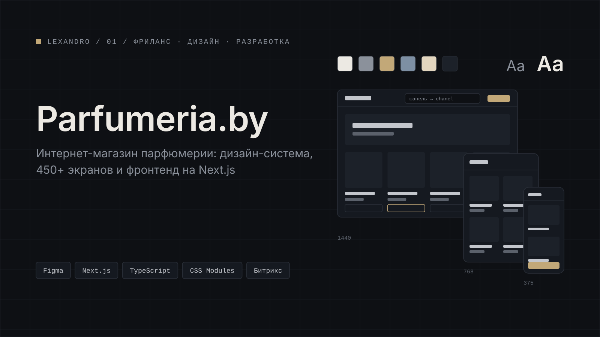

[← Все кейсы](../../README.md)

# Parfumeria.by

Интернет-магазин парфюмерии в Беларуси. Дизайн-система и более 450 экранов в Figma на трёх брейкпоинтах, фронтенд вынесен в отдельное приложение на Next.js, Aspro (1С-Битрикс) остаётся источником данных.

<table>
  <tr><td width="130"><b>Задача</b></td><td>Спроектировать интерфейс магазина на единой дизайн-системе и вынести фронтенд в отдельное приложение на Next.js; Aspro (Битрикс) остаётся источником данных</td></tr>
  <tr><td><b>Роль</b></td><td>Дизайн интерфейсов, дизайн-система, фронтенд-разработка</td></tr>
  <tr><td><b>Стек</b></td><td>Figma · Next.js (App Router) · TypeScript · CSS Modules · Aspro / 1С-Битрикс</td></tr>
  <tr><td><b>Результат</b></td><td>уточняется</td></tr>
  <tr><td><b>Период</b></td><td>уточняется</td></tr>
  <tr><td><b>Ссылки</b></td><td><a href="https://parfumeria.by">parfumeria.by</a> · код закрыт, в кейсе — дизайн и описание</td></tr>
</table>

## Содержание

- [Задача](#задача)
- [Роль](#роль)
- [Что сделано](#что-сделано)
- [Стек](#стек)
- [Результат](#результат)
- [Галерея](#галерея)

## Задача

Магазин работает на Aspro (1С-Битрикс), и Битрикс остаётся источником данных. Нужно было:

- собрать интерфейс на единой дизайн-системе и покрыть макетами все сценарии покупки на трёх брейкпоинтах;
- вынести фронтенд в отдельное приложение на Next.js, которое получает данные из Aspro/Битрикс.

<!-- Дополнить исходными проблемами и ограничениями, если их можно раскрыть. -->

## Роль

Отвечал за дизайн и клиентскую часть: дизайн-систему, макеты, архитектуру фронтенда и разработку на Next.js.

<!-- Уточнить состав команды, если работал не один. -->

## Что сделано

### Дизайн

- Дизайн-система в Figma: цвета, типографика, библиотека компонентов.
- Более 450 экранов на трёх брейкпоинтах.

### Фронтенд

- Новый фронтенд на Next.js (App Router) и TypeScript, стили на CSS Modules.
- Headless-каталог: данные о товарах приходят из Aspro/Битрикс, витрина отрисовывается на Next.js.
- Поиск с транслитерацией и дописыванием запроса: находит товар, если название введено транслитом (например, «шанель» → Chanel), и подсказывает варианты по мере ввода.
- Корзина.
- Вход по SMS.

## Стек

| Область | Инструменты |
|---|---|
| Дизайн | Figma |
| Фронтенд | Next.js (App Router), TypeScript, CSS Modules |
| Данные каталога | Aspro / 1С-Битрикс (headless) |

## Результат

уточняется

<!-- Только подтверждённые данные: сроки, скорость загрузки, конверсия, доля мобильного трафика. -->

## Галерея

*01 — дизайн-система: цвета, типографика, базовые стили*

*02 — библиотека компонентов: кнопки, поля, карточки товара, фильтры*

*03 — один экран на трёх брейкпоинтах рядом*

*04 — главная страница, десктоп*

*05 — каталог: листинг с фильтрами и сортировкой*

*06 — поиск: подсказки при вводе и запрос транслитом*

*07 — карточка товара*

*08 — корзина*

*09 — вход по SMS: ввод номера и кода*

*10 — общий вид файла Figma с экранами*

---

[← Все кейсы](../../README.md) · [Следующий кейс: mimimibot →](../mimimibot/)
