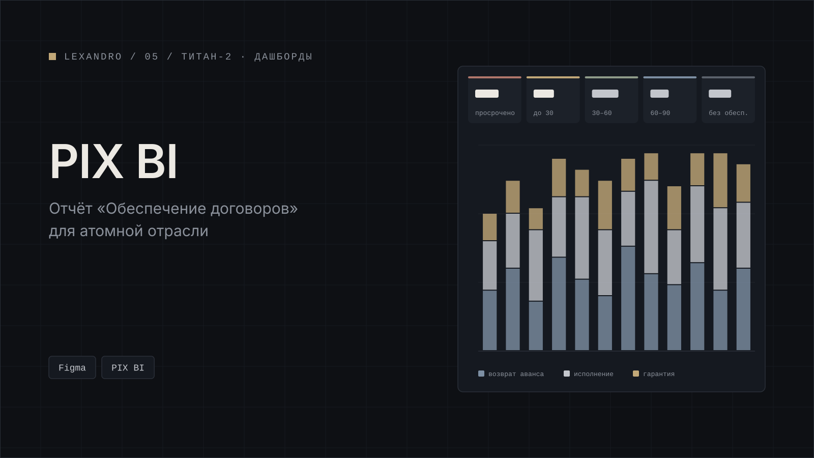

[← Все проекты](../../README.md) · [Работа в ТИТАН-2](../../README.md#работа-в-титан-2)

# PIX BI: обеспечение договоров

Дашборды отчётности в PIX BI. Здесь показан один отчёт, «Обеспечение договоров», для атомной отрасли.

В отчёте 6 экранов и справочная доска: обзор, детальный отчёт, аналитика, карточка договора, пустое состояние и справочная таблица.

Договоры разбиты на пять уровней срочности: просрочено, до 30 дней, 30-60, 60-90 и без обеспечения. На графике по месяцам обязательства разложены по типам: возврат аванса, исполнение, гарантия.

Макет готов к передаче заказчику. В нём больше 1200 текстовых слоёв, и все они на стилях. Экраны собраны на auto-layout и связаны в прототип.

**Стек:** Figma, PIX BI.

## Скриншоты

Все скриншоты на демо-данных.

*Обзор.*

*Детальный отчёт.*

*Аналитика: график по месяцам.*

*Карточка договора.*

*Пустое состояние.*

*Справочная доска: уровни срочности и стили.*

---

[← Все проекты](../../README.md) · [Дальше: сайт MEG →](../meg-site/)
