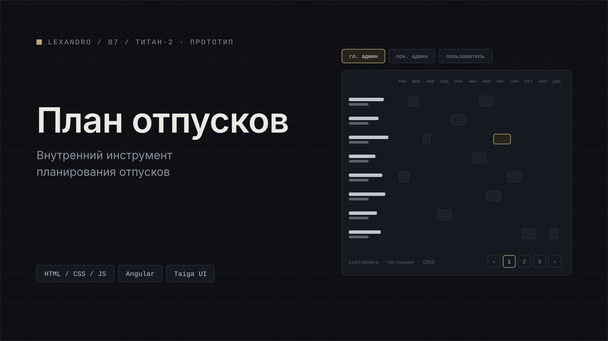

[← Все проекты](../../README.md) · [Работа в ТИТАН-2](../../README.md#работа-в-титан-2)

# План отпусков

Внутренний инструмент для планирования отпусков. Я собрал интерактивный прототип на HTML, CSS и JavaScript: таблица отпусков, настройки и три роли (главный администратор, локальный администратор и пользователь).

В прототипе работает CRUD сотрудников и должностей: модальные окна, валидация, подтверждения, уведомления, сортировка и пагинация.

**Стек:** HTML, CSS, JavaScript. Разработка: Angular, Taiga UI.

## Скриншоты

Все скриншоты на демо-данных.

*Таблица отпусков.*

*Добавление сотрудника с валидацией.*

*Подтверждение удаления и уведомление.*

---

[← Все проекты](../../README.md) · [Дальше: MiMiMi AI →](../mimimibot/)
